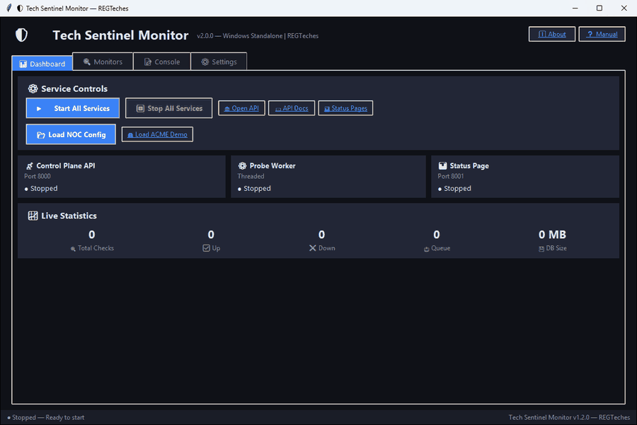
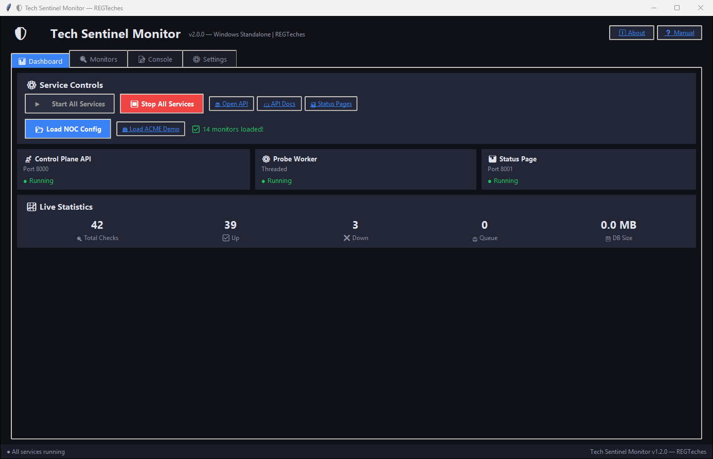

# Tech Sentinel Monitor

**Free, open-source, multi-tenant uptime monitoring platform** by REGTeches / Ronald Goodchild

A self-hostable monitoring system that provides HTTP, TCP, ping, and heartbeat probes with real-time alerting via webhooks, Slack, PagerDuty, and custom automation endpoints.

## Screenshots


*Windows standalone edition: start the services, load the demo layout, watch the checks come in*


*Windows standalone edition: services running with the demo layout loaded*

## Two ways to run it

| Edition | What it is | Start here |
|---------|-----------|------------|
| **Server edition** | Docker Compose / Helm stack: FastAPI control plane, TimescaleDB, Redis Streams, probe workers, status pages | [Quick Start](#quick-start) |
| **Windows standalone edition** | Single desktop app with a local SQLite database, built-in probe worker, alert engine and status page - no Docker needed | `pip install -r windows/requirements.txt` then `python windows/run.py` (or build an EXE with `windows/build_exe.py`) |

Lightweight **agents** in [`agents/`](agents/) (Windows and Linux) report system health (CPU, memory, disk, services) to the API.

## Architecture

```
Provisioner CLI ──▶ Control Plane API (:8000) ──▶ TimescaleDB (pg16)
                         │                              ▲
                    Redis Streams                       │
                         │                              │
                    Probe Worker ───────────────────────┘
                         │
                    Alert Engine → Webhook / Slack / PagerDuty
                                → TS Automation Endpoint

Status Page (:8001) ◀── reads from Control Plane API
```

## Components

| Component | Description |
|-----------|-------------|
| **Control Plane API** | FastAPI REST API — tenant CRUD, monitor CRUD, heartbeat endpoint, alert channels, status pages, webhook dispatcher, alert engine |
| **Probe Worker** | Redis Streams consumer — HTTP/TCP/ping/heartbeat probes, direct TimescaleDB writes, concurrent job processing |
| **Status Page** | FastAPI + Jinja2 — dark-themed responsive status pages per customer, auto-refresh, color-coded badges |
| **Provisioner CLI** | `ts-provisioner` — reads JSON layout, token substitution, idempotent provision/validate/status commands |

## Quick Start

```bash
# 1. Configure environment
cp .env.example .env
# Edit .env with your secrets

# 2. Start all services
docker compose up -d --build

# 3. Verify health
curl http://localhost:8000/health

# 4. Install provisioner CLI
pip install -e provisioner/

# 5. Run the demo (ACME Corp)
python demo/demo_provision.py

# 6. View status page
open http://localhost:8001/status/acme-status
```

## Authentication

Dual authentication supported:

- **API Key**: `X-TS-API-Key` header
- **JWT Bearer**: Exchange API key for JWT via `POST /api/v1/auth/token`

```bash
# Get JWT token
curl -X POST http://localhost:8000/api/v1/auth/token \
  -H "Content-Type: application/json" \
  -d '{"api_key": "your-tenant-api-key"}'

# Use JWT
curl http://localhost:8000/api/v1/monitors/ \
  -H "Authorization: Bearer <token>"
```

## API Reference

### Tenants
| Method | Endpoint | Description |
|--------|----------|-------------|
| `POST` | `/api/v1/tenants/` | Create tenant |
| `GET` | `/api/v1/tenants/` | List tenants |
| `GET` | `/api/v1/tenants/{id}` | Get tenant |
| `DELETE` | `/api/v1/tenants/{id}` | Delete tenant |

### Monitors
| Method | Endpoint | Description |
|--------|----------|-------------|
| `POST` | `/api/v1/monitors/` | Create monitor (requires auth) |
| `GET` | `/api/v1/monitors/` | List monitors |
| `GET` | `/api/v1/monitors/{id}` | Get monitor |
| `PATCH` | `/api/v1/monitors/{id}/status` | Pause/resume monitor |
| `DELETE` | `/api/v1/monitors/{id}` | Delete monitor |
| `GET` | `/api/v1/monitors/{id}/results` | Get check results |

### Alert Channels
| Method | Endpoint | Description |
|--------|----------|-------------|
| `POST` | `/api/v1/alert-channels/` | Create channel |
| `GET` | `/api/v1/alert-channels/` | List channels |

### Heartbeat
| Method | Endpoint | Description |
|--------|----------|-------------|
| `POST` | `/api/v1/heartbeat/{monitor_id}` | Record heartbeat |

### Status Pages
| Method | Endpoint | Description |
|--------|----------|-------------|
| `POST` | `/api/v1/status-pages/` | Create status page |
| `GET` | `/api/v1/status-pages/{slug}` | Get status page |

### Auth
| Method | Endpoint | Description |
|--------|----------|-------------|
| `POST` | `/api/v1/auth/token` | Exchange API key for JWT |

## Monitor Types

| Type | Description | Target Format |
|------|-------------|---------------|
| `http` | HTTP/HTTPS endpoint check | URL (e.g., `https://example.com`) |
| `tcp` | TCP port connectivity | `host:port` (e.g., `db.example.com:5432`) |
| `ping` | ICMP ping reachability | Hostname or IP |
| `heartbeat` | Passive check-in | Monitor ID (service calls heartbeat endpoint) |

## Alerting

- **Consecutive failure threshold**: Configurable (default: 3)
- **Auto-recovery notifications**: Sent when a monitor recovers
- **Channels**: Webhook, Slack, PagerDuty, Tech Sentinel Automation
- **Dispatch**: All channels notified simultaneously

## Provisioner CLI

```bash
# Validate a layout file
ts-provisioner validate layout.json

# Provision (dry run)
ts-provisioner provision layout.json --dry-run

# Provision with token substitution
ts-provisioner provision layout.json \
  -t ACME_WEBHOOK_URL=https://hooks.example.com \
  -t ACME_SLACK_WEBHOOK=https://hooks.slack.com/xxx

# Check system status
ts-provisioner status
```

## Configuration

| Variable | Description | Default |
|----------|-------------|---------|
| `POSTGRES_HOST` | TimescaleDB host | `timescaledb` |
| `POSTGRES_PORT` | TimescaleDB port | `5432` |
| `POSTGRES_DB` | Database name | `techsentinel` |
| `REDIS_HOST` | Redis host | `redis` |
| `TS_API_KEY` | Global API key | — |
| `TS_JWT_SECRET` | JWT signing secret | — |
| `TS_ALERT_CONSECUTIVE_FAILURES` | Failure threshold | `3` |
| `TS_PROBE_CONCURRENCY` | Max concurrent probes | `10` |
| `TS_SLACK_WEBHOOK_URL` | Default Slack webhook | — |
| `TS_PAGERDUTY_ROUTING_KEY` | Default PagerDuty key | — |

## Key Design Decisions

- **Auth**: Dual — `X-TS-API-Key` header OR JWT Bearer
- **Idempotency**: `external_id` with `UNIQUE(tenant_id, external_id)` — safe to re-run provisioning
- **Persistence**: TimescaleDB hypertable with auto-compression at 7 days, retention at 90 days
- **Job Queue**: Redis Streams with consumer groups — horizontal scaling by adding workers
- **Alerting**: Consecutive-failure counter with auto-recovery notifications

## Documentation

- [Runbook](docs/RUNBOOK.md) — Startup, shutdown, health checks, troubleshooting, scaling
- [Secrets Guide](docs/SECRETS.md) — Vault integration, K8s secrets, rotation
- [Probe IP Allow-Listing](docs/PROBE_IP_ALLOWLISTING.md) — Cloud NAT config, firewall rules
- [Maintenance Windows](docs/MAINTENANCE_WINDOWS.md) — Per-monitor and tenant-wide windows

## Status

Early but working: 44 automated tests, Docker/Helm packaging and CI. Expect rough edges - see [ROADMAP.md](ROADMAP.md) and the open issues, and please report what you find.

## Contributing

Ideas, bug reports and pull requests are welcome - see [CONTRIBUTING.md](CONTRIBUTING.md).

## License

[MIT](LICENSE) (c) 2026 REGTeches / Ronald Goodchild
